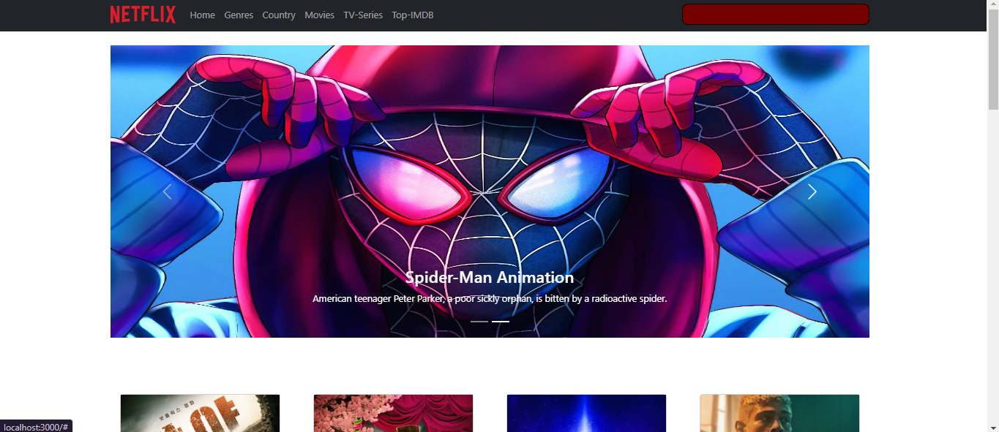
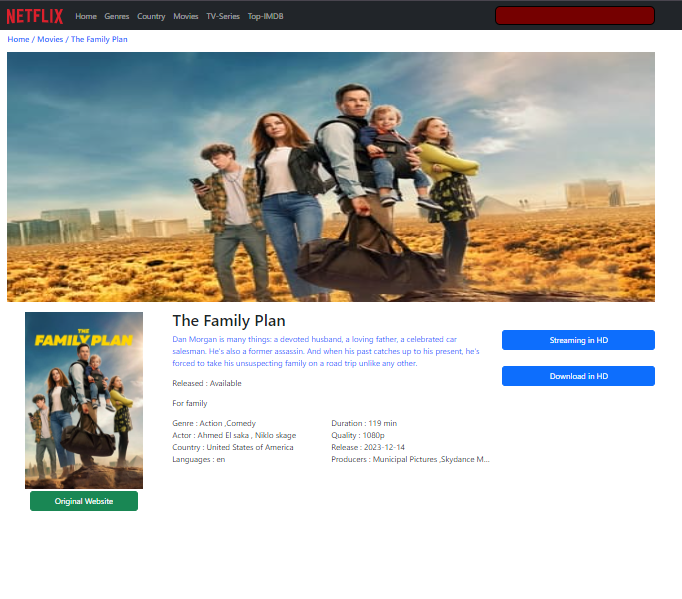

# Movies Website


----




# Movie Browser App with Pagination

This is a simple React application that allows users to browse movies with pagination. Users can navigate through pages of movies and view detailed information about each movie.

## Features

- Pagination: Browse through multiple pages of movies.
- Movie Details: View detailed information about each movie, including title, release date, genre, and synopsis.
- Responsive Design: The app is optimized for various screen sizes, including desktop and mobile devices.

## Technologies Used

- React: JavaScript library for building user interfaces.
- React Router: Declarative routing for React applications.
- Axios: Promise-based HTTP client for making requests to the movie API.
- Bootstrap: Front-end framework for building responsive and mobile-first websites.

## Installation

1. Clone the repository:

   ```bash
   git clone https://github.com/MO-Karam-007/movie-browser.git
   ```

2. Navigate to the project directory:

   ```bash
   cd movie-browser
   ```

3. Install dependencies:

   ```bash
   npm install
   ```

4. Start the development server:

   ```bash
   npm start
   ```

   The app will be running at `http://localhost:3000`.

## Usage

1. Open the app in your web browser.
2. Browse through pages of movies using the pagination controls.
3. Click on a movie to view detailed information about it.
4. Navigate back to the list of movies or continue browsing.

## Contributing

Contributions are welcome! If you find any issues or have suggestions for improvements, please feel free to open an issue or submit a pull request.
